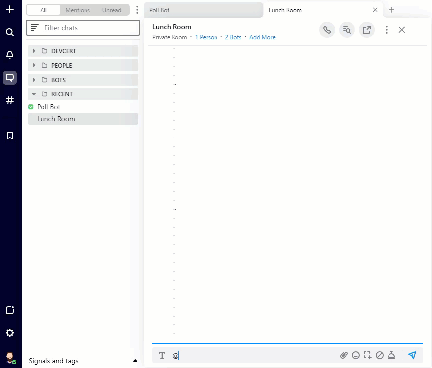
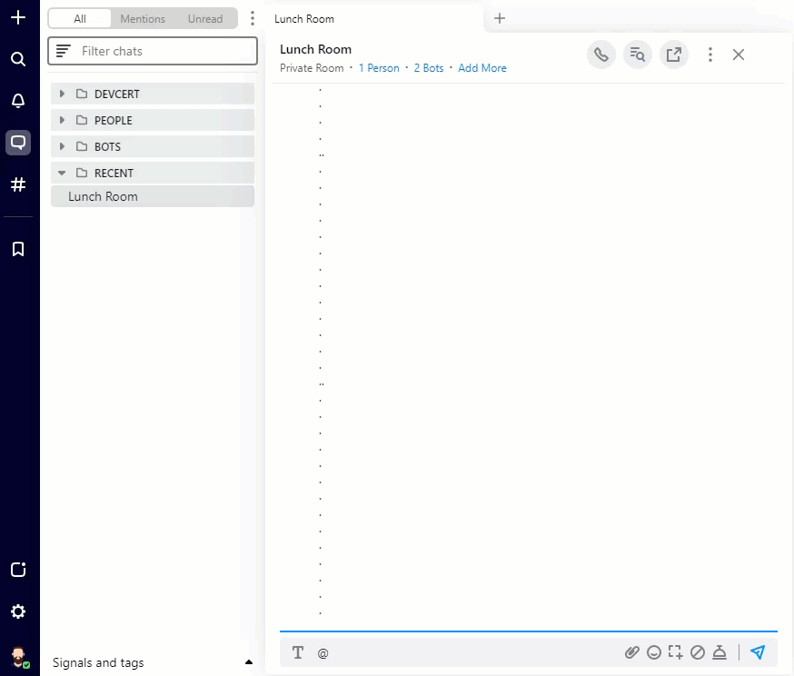

## Poll Bot
This bot uses Symphony Elements to facilitate the creation of polls, firing of poll messages, ending polls and collation of results. 

### Command-based
- `@Poll Bot /poll`
  - Sends a create poll form via IM 
  - When used in a room: targets the room
  - When used in an IM: includes a person selector field for private polls



### Dialog-based
- `@Poll Bot /pin`
  - Sends a button to the same chat that opens a re-submittable create poll form in a dialog 
  - Pins the message if used in an IM or when used in a room and the bot is a room owner 



## Requirements
* JDK 17+
* MongoDB

## Configuration
Fill up `src/main/resources/application.yaml` with the values for pod information and a mongo database uri
```yaml
spring:
  data.mongodb.uri: mongodb://

bdk:
  host: develop2.symphony.com
  bot:
    username: poll-bot-java
    privateKey.path: rsa/privatekey.pem
```
